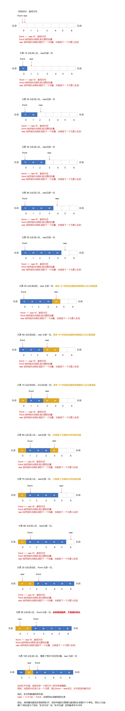

#### [641. 设计循环双端队列](https://leetcode.cn/problems/design-circular-deque/)

设计实现双端队列。

实现 MyCircularDeque 类:

- MyCircularDeque(int k) ：构造函数,双端队列最大为 k 。
- boolean insertFront()：将一个元素添加到双端队列头部。 如果操作成功返回 true ，否则返回 false 。
- boolean insertLast() ：将一个元素添加到双端队列尾部。如果操作成功返回 true ，否则返回 false 。
- boolean deleteFront() ：从双端队列头部删除一个元素。 如果操作成功返回 true ，否则返回 false 。
- boolean deleteLast() ：从双端队列尾部删除一个元素。如果操作成功返回 true ，否则返回 false 。
- int getFront() )：从双端队列头部获得一个元素。如果双端队列为空，返回 -1 。
- int getRear() ：获得双端队列的最后一个元素。 如果双端队列为空，返回 -1 。
- boolean isEmpty() ：若双端队列为空，则返回 true ，否则返回 false  。
- boolean isFull() ：若双端队列满了，则返回 true ，否则返回 false 。

**示例 1：**

```shell
输入
["MyCircularDeque", "insertLast", "insertLast", "insertFront", "insertFront", "getRear", "isFull", "deleteLast", "insertFront", "getFront"]
[[3], [1], [2], [3], [4], [], [], [], [4], []]
输出
[null, true, true, true, false, 2, true, true, true, 4]

解释
MyCircularDeque circularDeque = new MycircularDeque(3); // 设置容量大小为3
circularDeque.insertLast(1);			        // 返回 true
circularDeque.insertLast(2);			        // 返回 true
circularDeque.insertFront(3);			        // 返回 true
circularDeque.insertFront(4);			        // 已经满了，返回 false
circularDeque.getRear();  				// 返回 2
circularDeque.isFull();				        // 返回 true
circularDeque.deleteLast();			        // 返回 true
circularDeque.insertFront(4);			        // 返回 true
circularDeque.getFront();				// 返回 4
```

**提示：**

- 1 <= k <= 1000
- 0 <= value <= 1000
- insertFront, insertLast, deleteFront, deleteLast, getFront, getRear, isEmpty, isFull  调用次数不大于 2000 次


分析：



## 方法一：数组

```java
import java.util.Arrays;

class MyCircularDeque {

    private final int[] elements;
    private int capacity;
    private int front;
    private int rear;

    public MyCircularDeque(int k) {
        capacity = k + 1;
        elements = new int[capacity];
        // 头部指向第 1 个存放元素的位置
        // 插入时，先减，再赋值
        // 删除时，索引 +1（注意取模）
        front = 0;
        // 尾部指向下一个插入元素的位置
        // 插入时，先赋值，再加
        // 删除时，索引 -1（注意取模）
        rear = 0;
    }
    
    public boolean insertFront(int value) {
        if (isFull()) {
            return false;
        }
        elements[front = (front - 1 + capacity) % capacity] = value;
        return true;
    }
    
    public boolean insertLast(int value) {
        if (isFull()) {
            return false;
        }
        elements[rear] = value;
        rear = (rear + 1 + capacity) % capacity;
        return true;
    }
    
    public boolean deleteFront() {
        if (isEmpty()) {
            return false;
        }
        // front 被设计在数组的开头，所以是 +1
        front = (front + 1 + capacity) % capacity;
        return true;
    }
    
    public boolean deleteLast() {
        if (isEmpty()) {
            return false;
        }
        // rear 被设计在数组的末尾，所以是 -1
        rear = (rear - 1 + capacity) % capacity;
        return true;
    }
    
    public int getFront() {
       if (isEmpty()) {
            return -1;
        }
        return elements[front];
    }
    
    public int getRear() {
        if (isEmpty()) {
            return -1;
        }
        return elements[(rear - 1 + capacity) % capacity];
    }
    
    public boolean isEmpty() {
        return front == rear;
    }
    
    public boolean isFull() {
        return (rear + 1) % capacity == front;
    }

    public static void main(String[] args) {
        MyCircularDeque circularDeque = new MyCircularDeque(6);
        System.out.println(circularDeque.insertLast(10));
        System.out.println(circularDeque.insertLast(20));
        System.out.println(circularDeque.insertLast(30));
        System.out.println(circularDeque.insertLast(40));
        System.out.println(circularDeque.insertLast(50));
        System.out.println(circularDeque.deleteLast());
        System.out.println(circularDeque.deleteLast());
        System.out.println(circularDeque.deleteFront());
        System.out.println(circularDeque.insertLast(60));
        System.out.println(circularDeque.insertLast(70));
        System.out.println(circularDeque.insertLast(80));
        System.out.println(circularDeque.deleteFront());
        System.out.println(circularDeque.insertLast(90));
        System.out.println(circularDeque.insertLast(100));
        System.out.println(Arrays.toString(circularDeque.elements));

    }
}
```

```java
/**
* 或者使用判断，保证数组越界之后从头开始循环
*/
class MyCircularDeque {

    private final int[] elements;
    private int size = 0;
    private int head = 0;
    private int tail;

    public MyCircularDeque(int k) {
        elements = new int[k];
        tail = k - 1;
    }
    
    public boolean insertFront(int value) {
        if (isFull()) {
            return false;
        }
        elements[head = head == 0 ? elements.length - 1 : head - 1] = value; // 头指针左移
        size++;
        return true;
    }
    
    public boolean insertLast(int value) {
        if (isFull()) {
            return false;
        }
        elements[tail = tail == elements.length - 1 ? 0 : tail + 1] = value; // 尾指针右移
        size++;
        return true;
    }
    
    public boolean deleteFront() {
        if (isEmpty()) {
            return false;
        }
        head = head == elements.length - 1 ? 0 : head + 1; // 头指针右移
        size--;
        return true;
    }
    
    public boolean deleteLast() {
        if (isEmpty()) {
            return false;
        }
        tail = tail == 0 ? elements.length - 1 : tail - 1; // 头指针右移
        size--;
        return true;
    }
    
    public int getFront() {
        if (isEmpty()) {
            return -1;
        }
        return elements[head];
    }
    
    public int getRear() {
        if (isEmpty()) {
            return -1;
        }
        return elements[tail];
    }
    
    public boolean isEmpty() {
        return size == 0;
    }
    
    public boolean isFull() {
        return size == elements.length;
    }
}
```


## 方法二：链表

