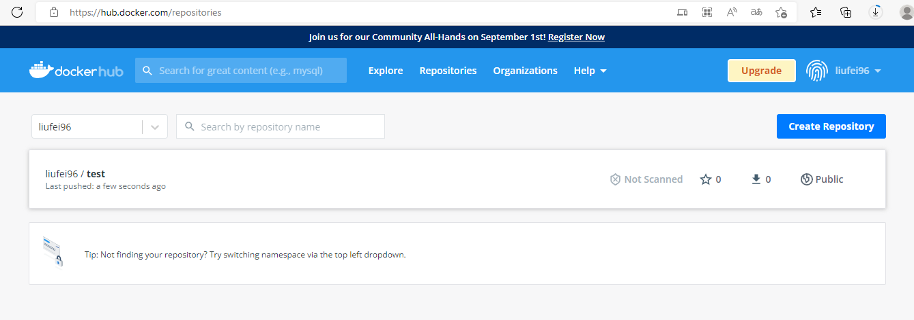

# 第三章：使用Docker镜像

镜像是 Docker 三大核心概念中最重要的，自 Docker 诞生之日起镜像就是相关社区最为热门的关键词。

Docker 运行容器前需要本地存在对应的镜像，**如果镜像不存在， Docker 会尝试先从默认镜像仓库下载**（默认使用 Docker Hub 公共注册服务器中的仓库），用户也可以通过配置，使用自定义的镜像仓库。

## 3.1 获取镜像

使用 docker [image] pull 命令直接从 Docker Hub 镜像源来下载镜像。该命令的格式为 docker [image] pull NAME [: TAG]

其中， NAME 是镜像仓库名称（用来区分镜像）， TAG 是镜像的标签（往往用来表示版本信息）。通常情况下，描述一个镜像需要包括“名称＋标签“信息。

例如，获取一个 Ubuntu 18.04 系统的基础镜像可以使用如下的命令：

```shell
$ docker pull ubuntu:18.04
18.04: Pulling from library/ubuntu
22c5ef60a68e: Pull complete
Digest: sha256:eb1392bbdde63147bc2b4ff1a4053dcfe6d15e4dfd3cce29e9b9f52a4f88bc74
Status: Downloaded newer image for ubuntu:18.04
docker.io/library/ubuntu:18.04
```

对于 Docker 镜像 说，如果不显式指定 TAG, 则默认会选择 `latest` 标签，这会下载仓库中最新版本的镜像。

下面的例子将从 DockeHub Ubuntu 仓库下载一个最新版本的 Ubuntu 操作系统的镜像：

```shell
$ docker pull ubuntu
Using default tag: latest
latest: Pulling from library/ubuntu
d19f32bd9e41: Pull complete
Digest: sha256:34fea4f31bf187bc915536831fd0afc9d214755bf700b5cdb1336c82516d154e
Status: Downloaded newer image for ubuntu:latest
docker.io/library/ubuntu:latest
```

该命令实际上下载的就是 ubuntu: lastest 镜像。

> 注意：一般来说，镜像的 latest 标签意味着该镜像的内容会跟踪最新版本的变更而变化，内容是不稳定的。因此，从稳定性上考虑，不要在生产环境中忽略镜像的标签信息或使用默认的 latest 标记的镜像。

下载过程中可以看出，镜像文件一般由若干层 (layer) 组成， 22c5ef60a68e 这样的串是层的唯一 id （实际上完整的 id 包括 256 比特， 64 个十六进制字符组成）。使用 docker pull 命令下载中会获取并输出镜像的各层信息。当不同的镜像包括相同的层时，本地仅存储了层的一份内容，减小了存储空间。

读者可能会想到，在不同的镜像仓库服务器的情况下，可能会出现镜像重名的情况。

严格地讲，镜像的仓库名称中还应该添加仓库地址（即 registry, 注册服务器）作为前缀，只是默认使用的是官方 DocketHub 服务，该前缀可以忽略。

例如， docker pull ubuntu:18.04 命令相当于 docker pull registry.hub.docker.com/ubuntu:18.04 命令，即从默认的注册服务器 DockeHub Registry 中的 ubuntu仓库来下载标记为 18.04 的镜像。

如果从非官方的仓库下载，则需要在仓库名称前指定完整的仓库地址。例如从网易蜂巢的镜像源来下载 ubuntu:18.04 镜像，可以使用如下命令，此时下载的镜像名称为 hub.c.163.com/public/ubuntu:18.04:

```shell
docker pull docker.mirrors.ustc.edu.cn/
```

pull 子命令支持的选项主要包括：

- -a, --all-tags true I false: 是否获取仓库中的所有镜像，默认为否；
- -－ disable-content－trust：取消镜像的内容校验，默认为真。

另外，有时需要使用镜像代理服务来加速 Do eke镜像获取过程，可以在 Docker 服务启动配置中增加 --registry-mirror==proxy_URL 来指定镜像代理服务地址（如 https://registry.docker-cn.com) 

> 配置文件如果没有，需要手动新建。/etc/docker/daemon.json
>
> ```json
> {
>   "registry-mirrors": ["https://hub-mirror.c.163.com","https://registry.aliyuncs.com","https://registry.docker-cn.com","https://docker.mirrors.ustc.edu.cn"]
> }
> ```

下载镜像到本地后，即可随时使用该镜像了，例如利用该镜像创建一个容器，在其中运行 bash 应用，执行打印 “Hello World" 命令：

```shell
$ docker run -it ubuntu:18.04 bash 
root@65663247040f:/# echo "Hello World" 
Hello World 
root@65663247040f:/# exit
```

## 3.2 查看镜像信息

主要介绍Dockers镜像的ls、tag、inspect子命令

**1. 使用 images 命令列出镜像**

```shell
# 查看镜像的信息 docker images 或 docker image ls
[root@192 docker]# docker images
REPOSITORY               TAG       IMAGE ID       CREATED        SIZE
ubuntu                   latest    df5de72bdb3b   7 days ago     77.8MB
ubuntu                   18.04     8d5df41c547b   7 days ago     63.1MB
```

在列出信息中，可以看到几个字段信息：

- 来自于哪个仓库，比如 ubuntu 表示 ubuntu 系列的基础镜像；
- 镜像的标答信息，比如 18.04、latest 表示不同的版本信息。标签只是标记，并不能标识镜像内容；

- 镜像的 ID （唯一标识镜像），如果两个镜像的 ID 相同，说明它们实际上指向了同一个镜像，只是具有不同标签名称而已；

- 创建时间，说明镜像最后的更新时间；
- 镜像大小，优秀的镜像往往体积都较小。

其中镜像的 ID 信息十分重要，它唯一标识了镜像。在使用镜像 ID 的时候，一般可以使用该 ID 的前若干个字符组成的可区分串来替代完整的 ID。

TAG 信息用于标记来自同一个仓库的不同镜像。例如 ubuntu 仓库中有多个镜像，通过TAG 信息来区分发行版本，如 18.04 18.10 等。

**镜像大小信息只是表示了该镜像的逻辑体积大小，实际上由于相同的镜像层本地只会存储一份，物理上占用的存储空间会小于各镜像逻辑体积之和。**

images 子命令主要支持如下选项，用户可以自行进行尝试：

-  -a, --all =true I false: 列出所有（包括临时文件）镜像文件，默认为否；
- --digests＝true I false: 列出镜像的数字摘要值，默认为否；

- -f, --filter=[ ］：过滤列出的镜像，如 dangling=true 只显示没有被使用的镜像；也可指定带有特定标注的镜像等；
-  --format＝“TEMPLATE" ：控制输出格式，如． ID 代表 ID 信息，.Repository代表仓库信息等；

- --no-trunc=true I false ：对输出结果中太长的部分是否进行截断，如镜像的 ID信息，默认为是；
-  -q, --quiet＝true I false ：仅输出 ID 信息，默认为否。

其中，还支持对输出结果进行控制的选项，如－ f. --filter=[] 、--no-trunc=true I false、-q、--quiet＝true I false 等。

更多子命令选项还可以通过 man docker-images 来查看。


**2. 使用 tag 命令添加镜像标签**

为了方便在后续工作中使用特定镜像，还可以使用 docker tag 命令来为本地镜像任意添加新的标签。例如，添加一个新的 myubuntu:latest 镜像标签：

```shell
$ docker tag ubuntu:latest myubuntu:latest
```

再次使用 docker images 列出本地主机上镜像信息，可以看到多了一个  标签的镜像：

```shell
[root@192 docker]# docker images
REPOSITORY               TAG       IMAGE ID       CREATED        SIZE
ubuntu                   latest    df5de72bdb3b   7 days ago     77.8MB
myubuntu                 latest    df5de72bdb3b   7 days ago     77.8MB
ubuntu                   18.04     8d5df41c547b   7 days ago     63.1MB
```

之后，用户就可以直接使用 myubuntu:latest 来表示这个镜像了。

细心的读者可能注意到，这些 myubuntu:latest 镜像的 ID ubuntu:latest 是完全一致的，它们实际上指向了同一个镜像文件，只是别名不同而已。 docker tag 命令添加的标签实际上起到了类似链接的作用。


**3. 使用 inspect 命令查看详细信息**

使用 docker [image] inspect 命令可以获取该镜像的详细信息，包括制作者、适应架构、各层的数字摘要等：

```shell
# 或者 docker inspect ubuntu:latest
$ docker inspect df5de72bdb3b
```

```json
[
    {
        "Id": "sha256:df5de72bdb3b711aba4eca685b1f42c722cc8a1837ed3fbd548a9282af2d836d",
        "RepoTags": [
            "myubuntu:latest",
            "ubuntu:latest"
        ],
        "RepoDigests": [
            "ubuntu@sha256:34fea4f31bf187bc915536831fd0afc9d214755bf700b5cdb1336c82516d154e"
        ],
        "Parent": "",
        "Comment": "",
        "Created": "2022-08-02T01:30:56.165288114Z",
       ...
]

```

上面代码返回的是一个 JSON 格式的消息，如果我们只要其中一项内容时，可以使用－f 来指定，例如，获取镜像的 Architecture:

```shell
[root@192 docker]# docker inspect -f {{".Architecture"}} df5de72bdb3b
amd64
```

**4.使用 history 命令查看镜像历史**

既然镜像文件由多个层组成，那么怎么知道各个层的内容具体是什么呢？这时候可以使 history 子命令，该命令将列出各层的创建信息。

例如，查看 ubuntu:18.04 镜像的创建过程，可以使用如下命令：

```shell
[root@192 docker]# docker history ubuntu:18.04
IMAGE          CREATED      CREATED BY                                      SIZE      COMMENT
8d5df41c547b   7 days ago   /bin/sh -c #(nop)  CMD ["bash"]                 0B
<missing>      7 days ago   /bin/sh -c #(nop) ADD file:0eb7f0555d03ff4f0…   63.1MB
```

注意，过长的命令被自动截断了，可以使用前面提到的 --no-trunc 选项来输出完整命令

```shell
[root@192 docker]# docker history ubuntu:18.04 --no-trunc
IMAGE                                                                     CREATED      CREATED BY                                                                                          SIZE      COMMENT
sha256:8d5df41c547bd107c14368ad302efc46760940ae188df451cabc23e10f7f161b   7 days ago   /bin/sh -c #(nop)  CMD ["bash"]                                                                     0B
<missing>                                                                 7 days ago   /bin/sh -c #(nop) ADD file:0eb7f0555d03ff4f0755bba2c3d133e68737888f41390c17710f64b70c8e662a in /    63.1MB
```

## 3.3 搜索镜像

> 本节主要介绍 Docker 镜像的 search 子命令。使用 docker search 命令可以搜索Docker Hub 官方仓库中的镜像。语法为 docker search [option] keyword。支持的命令选项主要包括：

-  -f, --filter filter: 过滤输出内容；
- --format string: 格式化输出内容；
- --limit int：限制输出结果个数，默认为 25 个；
- \- -no-trunc ：不截断输出结果。

例如，搜索官方提供的带 nginx 关键字的镜像，如下所示：

```shell
[root@192 docker]# docker search --filter=is-official=true nginx
NAME      DESCRIPTION                STARS     OFFICIAL   AUTOMATED
nginx     Official build of Nginx.   17220     [OK
```

再比如，搜索所有收藏数超过 的关键词包括 tensorflow 的镜像：

```shell

[root@192 docker]# docker search --filter=stars=4 tensorflow
NAME                                      DESCRIPTION                                     STARS     OFFICIAL   AUTOMATED
tensorflow/tensorflow                     Official Docker images for the machine learn…   2046
bitnami/tensorflow-serving                Bitnami Docker Image for TensorFlow Serving     29                   [OK]
armswdev/tensorflow-arm-neoverse-n1       Please use "armswdev/tensorflow-arm-neoverse"   10
ibmcom/tensorflow-ppc64le                 Community supported ppc64le docker images fo…   6
intel/intel-optimized-tensorflow          Containers with TensorFlow* optimized with o…   6
armswdev/tensorflow-arm-neoverse          TensorFlow builds for AArch64 CPUs              4
intel/intel-optimized-tensorflow-avx512   Containers with TensorFlow* optimized with o…   4
```

可以看到返回了很多包含关键字的镜像，其中包括镜像名字、描述、收藏数（表示该镜像的受欢迎程度）、是否官方创建、是否自动创建等。默认的输出结果将按照星级评价进行排序。

扩展：[关于TensorFlow | TensorFlow中文官网 (google.cn)](https://tensorflow.google.cn/)

## 3.4 删除和清理镜像

> 主要介绍Docker镜像的rm 和 prune 子命令

**1. 使用标签删除镜像**

使用 docker rmi docker image rm 命令可以删除镜像，命令格式为 docker rmi IMAGE ［IMAGE... ]，其中 IMAGE 可以为标签或 ID

- -f, -force 强制删除镜像，即使有容器依赖
- -no-prune: 不要清理未带标签的父镜像。

例如，要删除掉 myubuntu:latest 镜像，可以使用如下命令：

```shell
[root@192 ~]# docker rmi myubuntu:latest
Untagged: myubuntu:latest
```

本地的 ubuntu:latest 镜像是否会受到此命令的影响。无须担心，当同一个镜像拥有多个标签的时候， docker rmi 命令只是删除了该镜像多个标签中的指定标签而已，并不影响镜像文件。因此上述操作相当于只是删除了镜像 df5de72bdb3b 的一个标签副本而已。

```shell
[root@192 ~]# docker images
REPOSITORY               TAG       IMAGE ID       CREATED        SIZE
ubuntu                   latest    df5de72bdb3b   9 days ago     77.8MB
ubuntu                   18.04     8d5df41c547b   9 days ago     63.1MB
```

**但当镜像只剩下一个标签的时候就要小心了，此时再使用 docker rmi 命令会彻底删除镜像。**

例如通过执行 docker rmi 命令来删除只有一个标签的镜像，可以看出会删除这个镜像文件的所有文件层：

```shell

[root@192 ~]# docker rmi redis:latest
Untagged: redis:latest
Untagged: redis@sha256:9bc34afe08ca30ef179404318cdebe6430ceda35a4ebe4b67d10789b17bdf7c4
Deleted: sha256:3e42dd4e79c7b6e416d06dde0de3e8b6cc73bf8f59dea9d3f784ac63cf4665a9
Deleted: sha256:93776ad7e2c55350f03d3280a941f7e2a224b2f316ac55920482ae9e9c957af7
Deleted: sha256:8ce10fe669a875fdc81f289ccafae002fb266b32d31fbed362280c9b961374ce
Deleted: sha256:e8ab47c2eaa9529ad78c69a46ec3e9675b380b30a9882662938e0ca498aad1fc
Deleted: sha256:ded95474d32432b4f426765c177dede149b909df7c25a4094e2163ce549ac65d
Deleted: sha256:52bf38ea1f58a7a95a76d115609ca85543d346f6d0c9c098448e34af6c44b573
Deleted: sha256:92a4e8a3140f7a04a0e5a15793adef2d0e8889ed306a8f95a6cfb67cecb5f212
```

**2. 使用镜像ID删除镜像**

当使用 docker rmi 命令，并且后面跟上镜像的 ID （也可以是能进行区分的部分 ID 前缀）时，会先尝试删除所有指向该镜像的标签，然后删除该镜像文件本身。

注意，当有该镜像创建的容器存在时，镜像文件默认是无法被删除的，例如：先利用 ubun四： 18.04 镜像创建一个简单的容器来输出一段话： 

```shell
$ docker run ubuntu:18.04 echo 'hello! I am here!' 
```

使用 docker ps -a 命令可以看到本机上存在的所有容器：

```shell

[root@192 ~]# docker ps -a
CONTAINER ID   IMAGE                    COMMAND                  CREATED          STATUS                     PORTS     NAMES
ed876f9a707a   ubuntu:18.04             "echo 'hello! I am h…"   11 seconds ago   Exited (0) 5 seconds ago             gracious_tharp
```

可以看到，后台存在一个退出状态的容器，是刚基于 ubuntu:18.04 镜像创建的。 试图删除该镜像， Docker 会提示有容器正在运行，无法删除：

```shell

[root@192 ~]# docker rmi ubuntu:18.04
Error response from daemon: conflict: unable to remove repository reference "ubu                                                                                                                              ntu:18.04" (must force) - container ef24701e2aff is using its referenced image 8                                                                                                                              d5df41c547b
```

如果要想强行删除镜像，可以使用 -f 参数：

```shell
[root@192 ~]# docker rmi -f ubuntu:18.04
Untagged: ubuntu:18.04
Untagged: ubuntu@sha256:eb1392bbdde63147bc2b4ff1a4053dcfe6d15e4dfd3cce29e9b9f52a4f88bc74
Deleted: sha256:8d5df41c547bd107c14368ad302efc46760940ae188df451cabc23e10f7f161
```

**注意：通常并不推荐使用 -f 参数来强制删除一个存在容器依赖的镜像。正确的做法是， 先删除依赖该镜像的所有容器，再来删除镜像。**

首先删除容器 ed876f9a707a

```shell
[root@192 ~]# docker rm ed876f9a707a
ed876f9a707a
```

再来删除镜像

```shell
[root@192 ~]# docker rmi ubuntu:18.04
Untagged: ubuntu:18.04
Untagged: ubuntu@sha256:eb1392bbdde63147bc2b4ff1a4053dcfe6d15e4dfd3cce29e9b9f52a4f88bc74
Deleted: sha256:8d5df41c547bd107c14368ad302efc46760940ae188df451cabc23e10f7f161b
Deleted: sha256:e722d396f503c712107acad2a081b07e33e73d6286c43f58234f69345a216918
```

**3.清理镜像**

使用 Docker 一段时间后，系统中可能会遗留一些临时的镜像文件，以及一些没有被使 用的镜像，可以通过 docker image prune 命令来进行清理。

支持选项包括：

- -a,  -all：删除所有无用镜像，不光是临时镜像；
- -filter,  filter: 只清理符合给定过滤器的镜像；
- -f,  -force: 强制删除镜像，而不进行提示确认。

例如，如下命令会自动清理临时的遗留镜像文件层，最后会提示释放的存储空间：

```shell
[root@192 ~]# docker image prune -f
Total reclaimed space: 0B
[root@192 ~]#
```

>  prune  中文修剪得意思

## 3.5 创建镜像

创建镜像的方法主要有三种：基于已有镜像的容器创建、基于本地模板导入、基于 Dockerfile 创建。

本节主要介绍 Docker commit、import和build的子命令

**1.基于已有容器创建**

命令：docker [container]   commit [OPTIONS]  CONTAINER [REPOSITORY:[TAG]]

支持参数：

- -a, --author="" ：作者信息
- -c,  --change=[]：提交的时候执行 Dockerfile 指令，包括 CMD I ENTRYPOINT I ENV I EXPOSE I LABEL I ONBUILD I USER I VOLUME I WORKDIR 等。
- -m，--message=""：提交消息；
- -p，--pause=true：提交时暂停容器运行

运行ubuntu镜像，并对其进行修改

```shell
[root@192 ~]# docker run -it ubuntu:18.04 /bin/bash
root@8639d03debf4:/# touch test
root@8639d03debf4:/# exit
```

此时该容器与原 ubuntu:18.04 镜像相比，已经发生了改变，可以使用 docker [container] commit 命令来提交为一个新的镜像。提交时可以使用 ID 或名称来指定容器：

```shell
[root@192 ~]# docker commit -m "add a new file" -a "Docker Newbee" 8639d03debf4 test:01
sha256:5a0a7075b1f79dadfa8c50a9c4dd789d2553b8e1f0552412052a962a5f775042
```

此时再查看本地镜像列表

```shell
[root@192 ~]# docker images
REPOSITORY               TAG       IMAGE ID       CREATED          SIZE
test                     01        5a0a7075b1f7   53 seconds ago   63.1MB
ubuntu                   latest    df5de72bdb3b   12 days ago      77.8MB
ubuntu                   18.04     8d5df41c547b   12 days ago      63.1MB
```

**2.基于本地模板导入**

使用本地模板导入，命令;

docker [image] import [OPTION] file lURLl -[REPOSITORY  [:TAG]]

要直接导入一个镜像，可以使用 OpenVZ 提供的模板来创建，或者用其他已导出的镜像 模板来创建。 OPENVZ 模板的下载地址为 http://openvz.org/Download/templates/precreated。


**3.基于Dockerfile创建**

使用Dockerfile文件创建

下面给出Dockerfile 的一个简单示例，基千debian:strech-slim 镜像安装 Python 3  环境，构成一个新的 Python:3 镜像：

创建镜像的过程可以使用 docker [image] build 命令，编译成功后本地将多出一 Python:3 镜像:

> 3.1 不指定Dockerfile （不指定，默认是在当前目录下找Dockerfile文件）

下面是Dockerfile文件内容

```shell
From ubuntu:18.04

LABEL Version=1.0 maintainer="docker user <docker_user@github>"

RUN apt-get update && \
        apt-get install -y python3 && \ 
        apt-get clean && \ 
        rm -rf /var/lib/apt/lists/*
```

```shell
# 执行下面命令
docker build -t python:3 .
```

**注意：后面又一个点**

> 3.2 之地那个Dockerfile 的URL

```shell
docker build github.com/creack/docker-firefox
```

注意：这里是从github

> 指定DOckerfile文件地址

```
docker build -f /root/docker/Dockerfile .
```

**注意：后面又一个点**

## 3.6 存出和载入镜像

```shell
# 存出
# 支持参数: -o, -output string，导出镜像到指定的文件中。
docker [image] save

# 导入。
# 支持参数: -i, -input string 选项，从指定文件中读入镜像内容。
docker [image] load
```
**1. 保存镜像：**

```shell
[root@192 dokcer]# docker save -o ubuntu_18.04.tar ubuntu:18.04
```

然后就可以将ubuntu_18.04.tar 镜像文件分享给其他人

**2. 导入镜像：**

```shell
[root@192 dokcer]# docker load -i ubuntu_18.04.tar
或者
[root@192 dokcer]# docker load < ubuntu_18.04.tar
```

这将导入镜像及其相关的元数据信息（包括标签等）。导入成功后，可以使用 docker images 命令进行查看，与原镜像一致。

## 3.7 上传镜像

使用docker push

```shell
docker [image] push NAME[:TAG] | [REPOSTORY_HOST[:REGISTER_PORT]/]NAME[:TAG]
```

例如，用户 liufei96上传本地的liufei96/test:01镜像，可以先添加新的标签 liufei96/test:01 ，然后用 docker [image] push 命令上传镜像：

```shell
# 注意;liufei96是我的docker hub的用户，需要换成你自己的

The push refers to repository [docker.io/liufei96/test]
36cf4d3d20c5: Pushed
e722d396f503: Pushed
01: digest: sha256:d2d805b17b4ceada306e732acb4b4398f93758b97110ffe8fbb85478ab5ae172 size: 736
```

如果是第一次：需要先登录

```shell
# 使用docker login，然后输入自己的用户名和密码
[root@192 dokcer]# docker login
Authenticating with existing credentials...
WARNING! Your password will be stored unencrypted in /root/.docker/config.json.
Configure a credential helper to remove this warning. See
https://docs.docker.com/engine/reference/commandline/login/#credentials-store

Login Succeeded
```

上传完成之后，去docker hub上看下。[Docker Hub](https://hub.docker.com/repositories)

![image](F:\learning_java\_book\读书\Docker技术入门和实战\image\3.7_上传镜像.png


